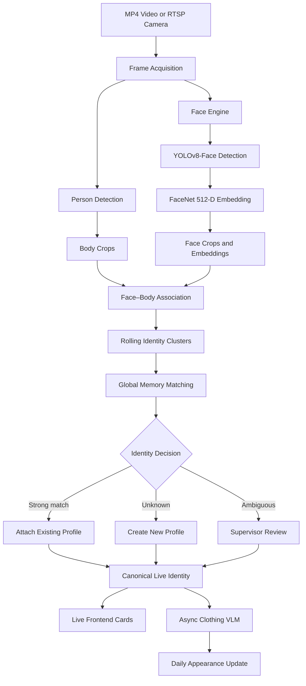
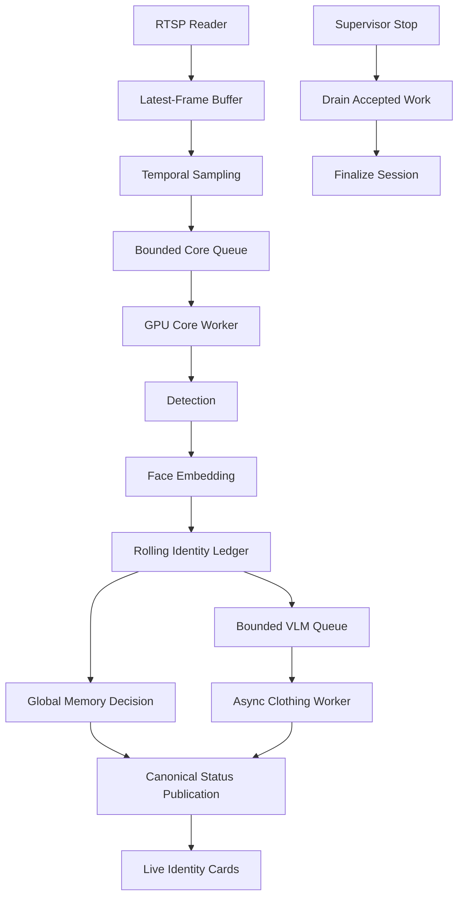

<div align="center">

# WAYCON

### Real-Time Person Identification and Persistent Global Identity Memory

Offline MP4 processing · Continuous RTSP analytics · Face recognition · Profile management

<br>


</div>

---

## Overview

**WAYCON** is a forensic and real-time video analytics platform for creating,
recognizing, and managing persistent person identities.

The system supports:

- offline processing of recorded MP4 videos;
- continuous processing of private RTSP cameras;
- face detection and 512-dimensional FaceNet embeddings;
- automatic face–body association;
- persistent identity matching through Global Memory;
- asynchronous clothing description;
- live identity cards;
- manual and batch phone-photo enrollment;
- profile editing, merging, archiving, and review.

The facial embedding is the permanent identity signal. Clothing, colors, body
ReID, timestamps, and camera information are supporting evidence.

---

## System Architecture



---

## Runtime Services

| Service | Responsibility | Default port |
|---|---|---:|
| Face Engine | Face detection and embedding | `5010` |
| Person Creation backend | Video workflow, APIs and Global Memory | `5009` |
| React frontend | Enrollment, live monitoring and profile management | `5175` |

---

## Processing Evolution

### 1. Offline MP4 Pipeline

The original pipeline processed one recorded video from beginning to end:


This established the identity, crop, clustering, and profile-building logic.

### 2. Continuous Real-Time Pipeline

The real-time architecture keeps camera capture active while inference,
identity matching, frontend publication, and appearance enrichment run
concurrently.



The Stop action does not begin identity processing. It only stops acquisition,
drains accepted work, and finalizes the session.

---

## Identity Mathematics

A detected face is represented by a FaceNet embedding:

\[
e \in \mathbb{R}^{512}
\]

The vector is L2-normalized:

\[
\hat{e} = \frac{e}{\lVert e \rVert_2}
\]

Because stored and query embeddings are normalized, cosine similarity becomes:

\[
s(\hat{q},\hat{e}) = \hat{q}^{T}\hat{e}
\]

The identity decision uses the strongest similarity \(s_1\), the second-best
similarity \(s_2\), and their margin:

\[
\Delta = s_1 - s_2
\]

The development decision policy is:

\[
D =
\begin{cases}
\text{new person}, & s_1 < \tau_{\min} \\
\text{attach existing}, &
s_1 \geq \tau_{\max}
\land \Delta \geq \tau_{\Delta}
\land n_f \geq n_{\min} \\
\text{review required}, & \text{otherwise}
\end{cases}
\]

Thresholds are configurable development values and require dataset-specific
calibration before production deployment.

---

## Automatic Face–Body Association

For each frame, the system calculates a geometric cost between every detected
face \(f_i\) and body \(b_j\):

\[
C_{ij} =
0.40C_{\text{containment}} +
0.25C_{\text{alignment}} +
0.20C_{\text{ratio}} +
0.15C_{\text{vertical}}
\]

The Hungarian algorithm then finds the minimum-cost one-to-one assignment.

Assignments are accepted only when they satisfy the configured geometric gates
and maximum cost.

---

## Real-Time Backpressure

All real-time queues are bounded:

\[
|Q| \leq K
\]

When a raw-frame queue is full, the oldest unprocessed frame is replaced:

\[
Q_{t+1} =
\operatorname{append}
\left(
\operatorname{dropOldest}(Q_t),
x_{t+1}
\right)
\]

Only replaceable raw frames may be dropped. Accepted detections, crops,
embeddings, identity decisions, and persistent evidence must not be discarded.

---

## Main Features

| Area | Capability |
|---|---|
| Video input | MP4 files and continuous RTSP streams |
| Face detection | YOLOv8-Face |
| Face embedding | FaceNet InceptionResnetV1, 512 dimensions |
| Person detection | GPU-supported person detector |
| Identity clustering | Offline and rolling live clustering |
| Identity persistence | SQLite Global Memory |
| Appearance | Clothing descriptions and color signals |
| Live interface | Continuously updated identity cards |
| Enrollment | Video, manual photo and batch folder import |
| Profile management | Search, edit, archive, restore and merge |
| Review | Ambiguous identity-review queue |
| Processing safety | Bounded queues and controlled shutdown |

---

## Profile Management

Open the Manage workspace:

```text
http://localhost:5175/manage
```

Available operations:

### Batch Import

1. Select a folder of phone photos.
2. Validate that each image contains exactly one face.
3. Detect and crop the face.
4. Generate the facial embedding.
5. Group duplicate photos of the same person.
6. Compare each group against Global Memory.
7. Preview decisions without modifying the database.
8. Commit the approved identities.

### Manual Creation

Create a profile using:

- a name;
- one phone photograph;
- optional notes.

### Manage Profiles

Supervisors can:

- search identities;
- rename profiles;
- inspect image history;
- choose a primary image;
- archive or restore a profile;
- merge duplicate identities;
- resolve pending identity reviews.

---

## Quick Start

### Terminal 1 — Face Engine

```bash
cd /mnt/c/Users/aziza/Documents/GitHub/WAYCON

export FACE_ENGINE_DEVICE=cuda
export HF_HUB_OFFLINE=1
export TRANSFORMERS_OFFLINE=1

python3 -m forensics.face_engine.service
```

### Terminal 2 — Backend

```bash
cd /mnt/c/Users/aziza/Documents/GitHub/WAYCON

export FACE_ENGINE_URL=http://127.0.0.1:5010
export PERSON_CREATION_USE_FACE_ENGINE=1
export PERSON_CREATION_DEVICE=cuda

python3 -m forensics.person_creation.service
```

### Terminal 3 — Frontend

```bash
cd /mnt/c/Users/aziza/Documents/GitHub/WAYCON/forensics/person_creation/frontend

npm run dev -- --host 0.0.0.0 --port 5175
```

Open:

```text
http://localhost:5175
```

---

## API Overview

| Method | Endpoint | Purpose |
|---|---|---|
| `GET` | `/api/health` | Backend health |
| `GET` | `/health` on port `5010` | Face Engine health |
| `POST` | `/api/person/process` | Start video processing |
| `POST` | `/api/person/stop/<job_id>` | Stop and drain a live job |
| `GET` | `/api/person/status/<job_id>` | Read live job status |
| `GET` | `/api/profiles` | List profiles |
| `GET` | `/api/profiles/<person_id>` | Read one profile |
| `POST` | `/api/profiles/import/preview` | Start batch preview |
| `POST` | `/api/profiles/import/<job_id>/commit` | Commit approved import |
| `GET` | `/api/profiles/reviews` | List pending reviews |

---

## Repository Structure

```text
WAYCON/
├── forensics/
│   ├── face_engine/
│   │   ├── service.py
│   │   ├── client.py
│   │   └── schemas.py
│   │
│   ├── global_memory/
│   │   ├── schema.sql
│   │   └── store.py
│   │
│   └── person_creation/
│       ├── frontend/
│       ├── nodes/
│       ├── graph.py
│       ├── live_core.py
│       ├── profile_management.py
│       └── service.py
│
├── tests/
├── .env.example
├── .gitignore
└── README.md
```

---

## Runtime Data

Runtime databases, generated media, model caches, logs, and frontend build
artifacts are intentionally excluded from Git.

Examples:

```text
forensics/global_memory.db
forensics/global_memory.db-wal
forensics/global_memory.db-shm
forensics/person_db/
runtime_logs/
frontend/dist/
frontend/node_modules/.vite/
__pycache__/
```

Each developer creates their own local database and runtime media.

---

## Security

- Never commit RTSP credentials.
- Never expose private cameras directly to the public internet.
- Keep API keys and passwords in local environment files.
- Do not commit `.env`.
- Validate all media paths before serving images.
- Keep Global Memory and biometric evidence access restricted.
- Use encrypted outbound connectivity for remote GPU processing.

---

## Current Status


The system is ready for local real-camera and real-photo functional testing.
Production deployment still requires identity-threshold calibration, extended
load testing, monitoring, access control, and deployment hardening.

---

## Team

| Member | Area |
|---|---|
| Aziz | Real-time architecture and integration |
| Hadil | WAYCON development |
| Khalifa | WAYCON development |
| Mdhaffer | WAYCON development |

---

<div align="center">

### WAYCON — Persistent Identity from Video Evidence

Built for offline forensics and continuous real-time camera analytics.

</div>
